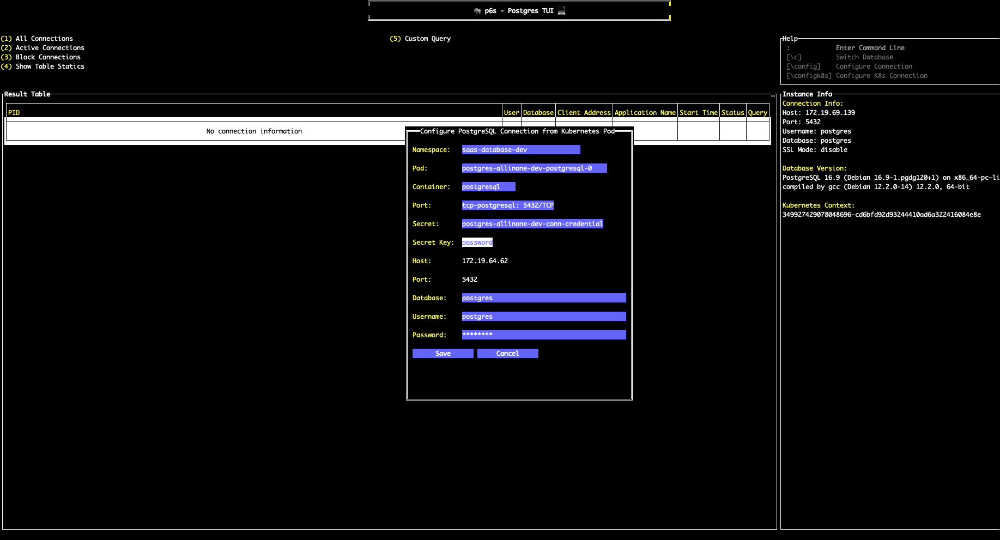
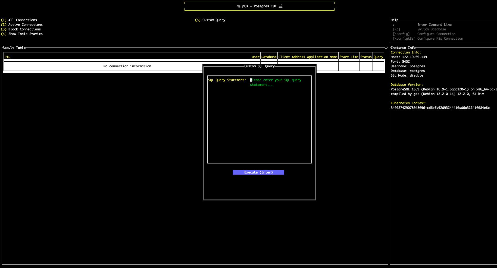

# p6s - PostgreSQL Terminal Management Tool

<div align="center">
  
</div>

<div align="center">
  <a href="README.md">English</a> | <a href="README_zh.md">中文</a>
</div>

## Introduction

p6s is a terminal-based PostgreSQL database management tool developed in Go, providing an intuitive text user interface (TUI) for managing and monitoring PostgreSQL database connections. It enables easy access to PostgreSQL instances deployed anywhere, especially in Kubernetes clusters, without requiring additional IDEs or SQL clients, making database management simpler and more efficient.

## Key Features

- **Built-in Database Monitoring**: Quickly access comprehensive database information through built-in functions:
  - View all/active/blocked database connections with real-time status
  - Display database table statistics including size, row count, and index information
  - One-click filtering and switching between different connection views
- **Kubernetes Native Integration**: Seamlessly connect to PostgreSQL instances in Kubernetes clusters:
  - Auto-discover PostgreSQL pods through local kubeconfig
  - Direct selection of pods, containers, and associated secrets
  - Automatic credential extraction from Kubernetes secrets
  - Support for port-forwarding and namespace switching
- **Connection Management**: Connect to PostgreSQL database servers with support for configuring and saving connection information
- **Database Switching**: Quick switching between different databases
- **Command Mode**: Support for executing commands within the application
- **Custom SQL Queries**: Execute custom SQL queries with results display

## Screenshots

### Kubernetes Configuration

<div align="center">
  
</div>

### Query Data Using SQL

<div align="center">
  
</div>

## Usage

### Building From Source


1. **Clone the repository**
   ```bash
   git clone https://github.com/your-username/p6s.git
   cd p6s
   ```

2. **Build and run the executable**
   ```bash
   # Using Makefile (recommended)
   make build
   
   # Or build manually
   go build -o p6s cmd/p6s/main.go
   
   # Run the application
   ./p6s
   ```

3. **Cross-platform builds**
   ```bash
   # Build for all platforms (recommended)
   make build-all
   
   # Or build for specific platforms
   make build-linux-amd64
   make build-linux-arm64
   make build-windows-amd64
   make build-darwin-amd64
   make build-darwin-arm64
   
   # Manual builds (alternative)
   GOOS=linux GOARCH=amd64 go build -o build/p6s-linux-amd64 cmd/p6s/main.go
   GOOS=linux GOARCH=arm64 go build -o build/p6s-linux-arm64 cmd/p6s/main.go
   GOOS=windows GOARCH=amd64 go build -o build/p6s-windows-amd64.exe cmd/p6s/main.go
   GOOS=darwin GOARCH=amd64 go build -o build/p6s-darwin-amd64 cmd/p6s/main.go
   GOOS=darwin GOARCH=arm64 go build -o build/p6s-darwin-arm64 cmd/p6s/main.go
   ```

### Basic Operations

- **Configure Connection**: After starting the application, configure database connection information (host, port, username, password, database name, SSL mode)
- **Switch Database**: Use `\c` command or menu options to switch to different databases
- **View Connections**: Main interface displays all connection information for the current database
- **Filter Connections**: Use menu to select different filter conditions (all connections, active connections, blocked connections)
- **Command Mode**: Press `:` to enter command mode for executing specific commands

### Keyboard Shortcuts

- `:` - Enter command line mode
- `\c` - Switch database
- `\config` - Configure connection information
- `\k8s` - Kubernetes commands

## Configuration File

Connection configuration information is saved in the `.p6s/config.json` file in the user's home directory, containing database connection settings and Kubernetes integration parameters:

```json
{
  "host": "",
  "port": "",
  "username": "",
  "password": "",
  "database": "",
  "sslmode": "",
  "namespace": "",
  "pod": "",
  "container": "",
  "port_name": "",
  "secret": "",
  "secret_key": ""
}
```

## Dependencies

- [github.com/gdamore/tcell/v2](https://github.com/gdamore/tcell) - Terminal interface library
- [github.com/rivo/tview](https://github.com/rivo/tview) - Terminal UI component library based on tcell
- [github.com/lib/pq](https://github.com/lib/pq) - PostgreSQL driver
- [k8s.io/client-go](https://github.com/kubernetes/client-go) - Kubernetes client library

## License

MIT License

## Star History

[](https://www.star-history.com/#XiangyuFan17/p6s&Date)